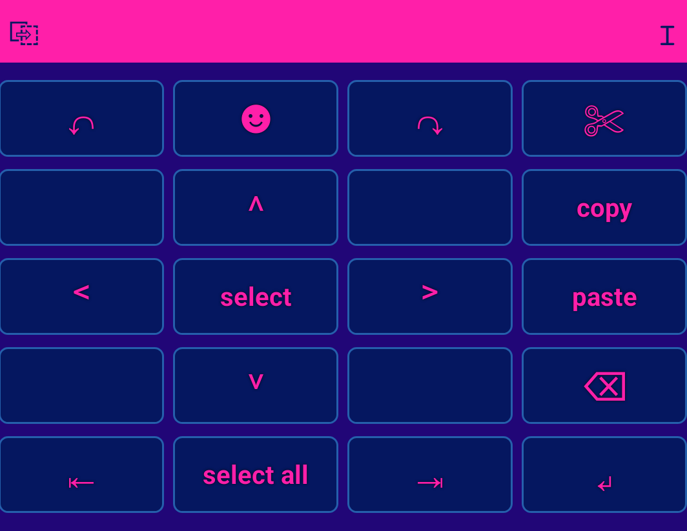
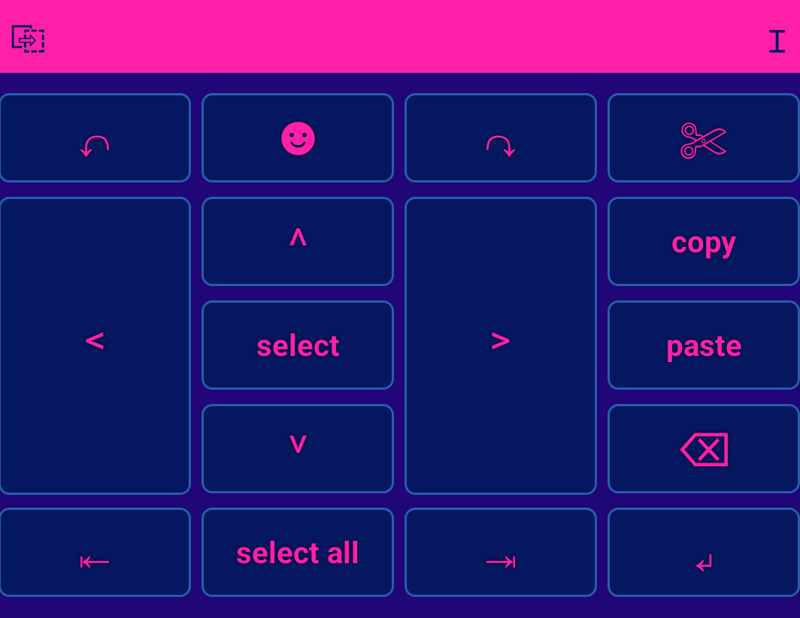

#  FQ-HLL Keyboard 


## Description
The FQ-HLL (Frequency-Quantized HyperLogLog) keyboard is an Android keyboard, that uses the efficient and minimal memory usage [FQ-HLL Autocorrection](https://github.com/shun4midx/FQ-HyperLogLog-Autocorrect) algorithm, which [Shun](https://github.com/shun4midx) took part in creating to become a reality. Its main data structure was the cardinality estimator "HLL". More specifically, it uses certain properties of HLL's bit registers to simulate different frequencies without needing additional storage.

Of course, Shun's fascination over algorithms has inspired the FQ-HLL algorithm, since HLL is rarely used in this context. Yet, more importantly, he is also dyslexic, and has struggled for years never finding a fitting mobile keyboard for him. Autocorrection even by top companies rarely accounted for dyslexics, and oftentimes his typos would not be corrected, unless he manually corrects them himself. Surely, this frustration influenced his creation of the FQ-HLL Autocorrection algorithm --- it almost became a perfect depiction of how he reads as a dyslexic person. He found he did not require as much brainpower anymore to type with this keyboard due to the more dyslexia-friendly autocorrection suggestions, such as "klof" -> "folk".

Thus, here we present the FQ-HLL keyboard which uses the fast and low memory FQ-HLL Autocorrection algorithm. It's made for everyone but especially dyslexic people in mind, with an autocorrection algorithm that hopefully eases common frustrations with autocorrection. FQ-HLL does not require knowledge of any particular language, requiring only a dictionary to achieve high accuracy, which makes it perfect for multilingual users. The ability to have custom dictionaries would also be implemented in the future.

## Installation

Download the latest release of the app [here](https://github.com/shun4midx/FQ-HLL-Keyboard/releases/latest), install the apk and head to your phone's keyboard settings. Enable `FQ-HLL Keyboard` and switch to the keyboard.

You can also launch system keyboard settings and switch keyboards from the installed app.

Keyboard settings can be found by launching the FQ-HLL Keyboard app installed with the apk, or by pressing the `⎋` button on the keyboard/holding down enter key in zhuyin keyboard.

Keyboard settings are saved across updates of the app.

### Usage

#### Suggestion Bar

The bolded word will autoreplace your typed word (user-word) if you hit space.

When there is a bolded suggestion, the first suggestion to the left is the user-word. You can long press the user-word to add it to dictionary, or long press a suggestion to remove the suggestion from dictionary.

If the suggestion is wrong, you can long press enter to skip the replacement.

You can long press the text editor button to change languages.

#### Main Keyboard

| Key | Long Press function |
|-----|---------------------|
| comma `,` | select all |
| symbols `!?#` | numpad |
| enter `↵` | skip replacement |

#### Clipboard

The clipboard displays text copied from the text editor. You can paste an item by clicking on its box.

You can delete an item by long pressing its box, or long press the clipboard button to clear the entire clipboard.

#### Numpad

You can access the numpad by long pressing symbols, or through the emoji keyboard.

#### Text Editor

- grid mode (left), maximize mode (right)

 

## Customisation

### Keyboard height

You can build a custom apk using github actions with the keyboard height of your choice. The built apk will be exported as the workflow run artifact. Use the example workflow below or [fork this repository](https://github.com/shun4midx/FQ-HLL-Keyboard/fork) and run [trigger_custom_apk.yml](https://github.com/shun4midx/FQ-HLL-Keyboard/blob/main/.github/workflows/trigger_custom_apk.yml).

Choose the "Custom" keyboard height in settings to use it. Note that the built apk is a debug apk and is not signed unlike the official releases.

[example workflow](https://github.com/shun4midx/FQ-HLL-Keyboard/blob/main/.github/workflows/trigger_custom_apk.yml):
```yml
name: Build custom FQ-HLL Keyboard apk

on:
  workflow_dispatch:

jobs:
  build:

    uses: shun4midx/FQ-HLL-Keyboard/.github/workflows/build_custom_apk.yml@main
    with:
      # in dp; default main keyboard heights are short: 45, medium: 50, tall: 60
      keyboard-height: 50
```

### Themes

You can view the themes in the [themes folder](https://github.com/shun4midx/FQ-HLL-Keyboard/tree/main/themes#readme).

Want a custom theme? Customisable themes may be implemented in the future, but until then you can open an issue to request one. Please include hex codes of key colour, key text colour, key pressed colour, key border colour, keyboard background colour, suggestion bar colour, and suggestion bar text colour. Alternatively, fork the repository, edit themes.xml, and either build your own apk or open a pull request.

## Features

- FQ-HLL autocorrect algorithm
- Clipboard, text editor, symbols, and emojis
- Coyote-time-like handling of simutaneous key presses
- Autocorrect/autocapitalization toggle
- Lots of themes and theme customisability (key colour, key text colour, key pressed colour, key border colour, keyboard background colour, suggestion bar (text) colour)
- Height customisation (short, medium, tall)
- Text editor mode customisation (maximize, grid)
- Multiple keyboard layouts with layout specific autocorrection (qwerty, azerty, qwertz, dvorak, colemak)
- (upcoming) zhuyin support

## Development usage

Install android studio and run the app. The usage after installation is the same as [installing from apk](https://github.com/shun4midx/FQ-HLL-Keyboard?tab=readme-ov-file#installation).

### Keyboard files

`CustomKeyboardApp.java` and `MainActivity.kt` contains the code of the keyboard and the settings app respectively.

```
app/src/main
|-- AndroidManifest.xml
|-- cpp
|   |-- CMakeLists.txt
|   |-- FQ-HyperLogLog-Autocorrect (repo)
|   `-- native-lib.cpp
|-- java.com.fqhll.keyboard
|   |-- CustomKeyboardApp.java
|   |-- CustomKeyboardView.java
|   |-- MainActivity.kt
|   `-- Suggestion.java
`-- res
    |-- drawable
    |   |-- key_background.xml
    |   |-- key_popup_background.xml
    |   |-- key_popup_view.xml
    |   |-- key_pressed_background.xml
    |   `-- key_unpressed_background.xml
    |-- layout
    |   |-- activity_main.xml
    |   |-- custom_keyboard_layout.xml
    |   |-- custom_keyboard_preview.xml
    |   `-- spinner.xml
    `-- xml
        |-- clipboard.xml
        |-- custom_keypad_azerty.xml
        |-- custom_keypad_colemak.xml
        |-- custom_keypad_dvorak.xml
        |-- custom_keypad_medium.xml
        |-- custom_keypad_qwerty.xml
        |-- custom_keypad_qwertz.xml
        |-- custom_keypad_short.xml
        |-- custom_keypad_tall.xml
        |-- custom_keypad_zhuyin.xml
        |-- custom_method.xml
        |-- editor_grid.xml
        |-- editor_maximize.xml
        |-- emojis.xml
        |-- numpad.xml
        `-- symbols.xml
```

### latest development apk

They are not guaranteed to work, but you get the latest features. Feel free to open an issue if you found a bug that isn't listed in the todo below.

https://github.com/shun4midx/FQ-HLL-Keyboard/blob/main/app/build/outputs/apk/debug/app-debug.apk

Prereleases are relatively more tested development versions of the app if you prefer a more stable app.

### todo

- [ ] customise symbols
- [ ] fully customise themes
- [x] emoji support (emoji page like symbols?)
- [x] clipboard
- [x] settings app layout
- [ ] hold keys for symbols
- [ ] multiple languages support?
- [ ] customise keyboard height
- [ ] custom background image
- [ ] key opacity
- [ ] custom key preview colour
- [x] figure out a way to build gradle project using github actions
- [x] fix unsigned release apk not working
- [x] sign apk
- [x] second page of symbols
- [x] be able to delete highlighted text
- [x] load changed themes without needing a refresh of keyboard (and without breaking popup/preview)
- [x] coyote-time-like queueing of handling simutaneous key presses
- [x] an easy way to add word to dictionary
- [ ] emoji suggestions in place of predictive text
- [x] bypass autocorrected word by long pressing enter
- [x] numpad
- [x] add grid/maximize mode previews to readme
- [ ] changing non main keyboard height
- [x] text editor symbols
- [x] fully finish text editor
- [ ] clipboard being able to access/use android copy key
- [x] add different keyboard layouts
- [x] hold down clipboard button to delete individual entries
- [x] edit dictionary by holding down button
- [x] edit dictionary in app
- [x] custom keyboard layout autocorrection
- [ ] export/import custom dictionary
- [x] check if word is null before adding/removing
- [ ] add key sound
- [ ] hold down . to delete word
- [ ] text editor select button

## Contact

You can contact Shun via [Email](mailto:shun4midx@gmail.com) or Discord at @shun4midx, and Ducky via [Email](mailto:ducky4life@duck.com).
