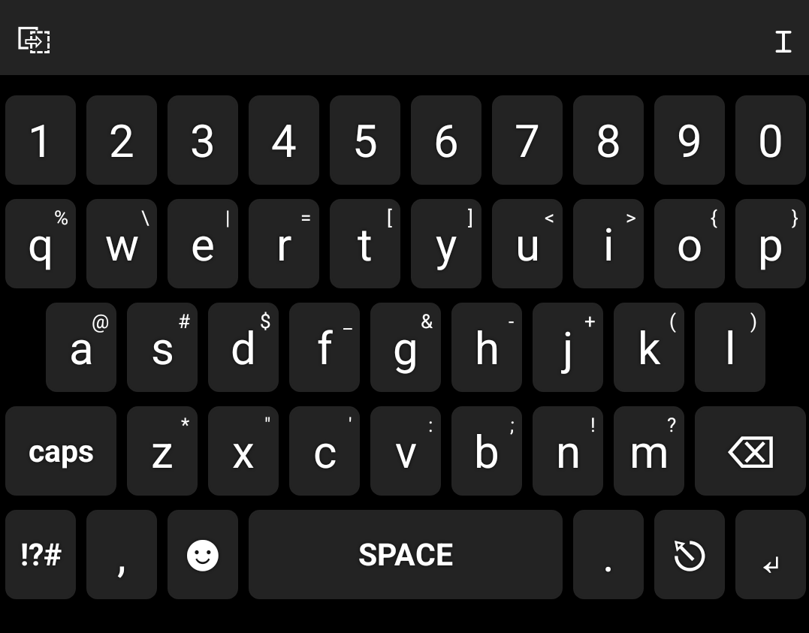
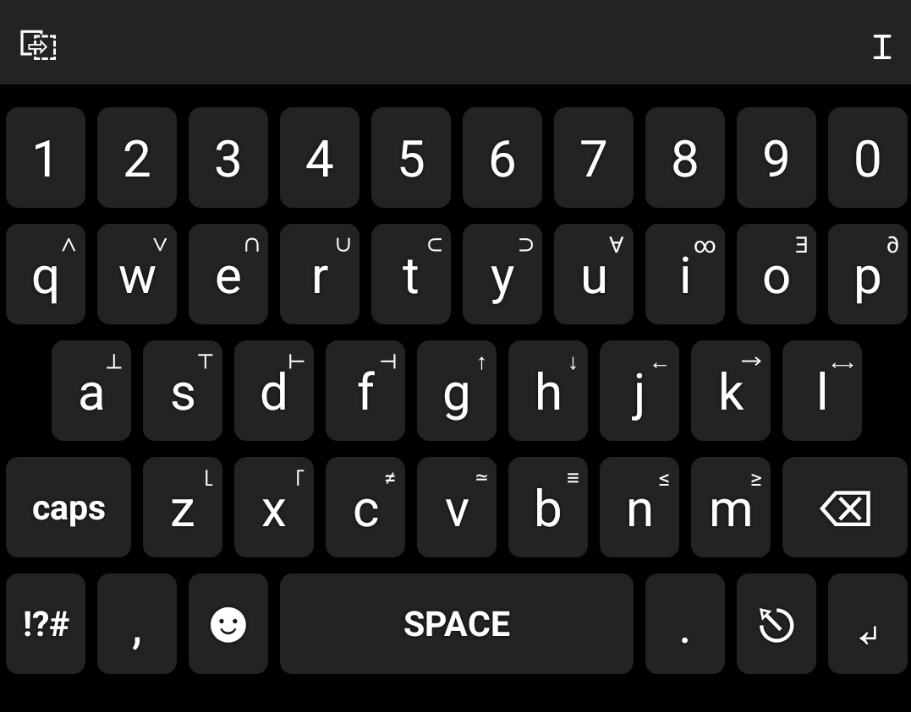
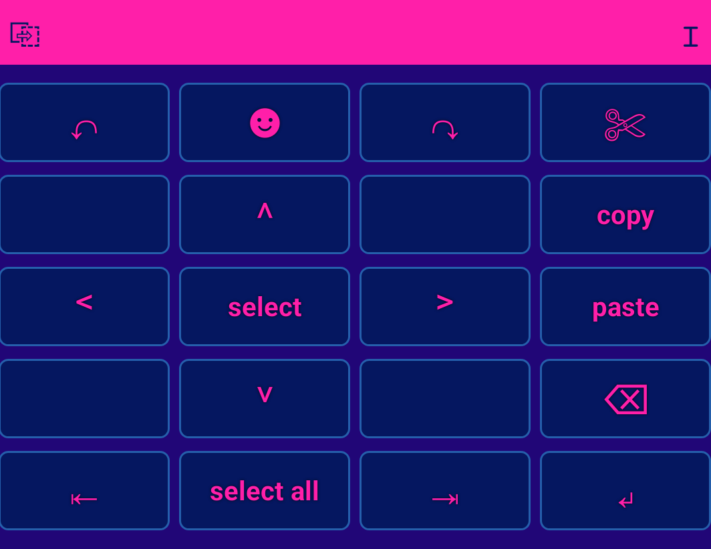
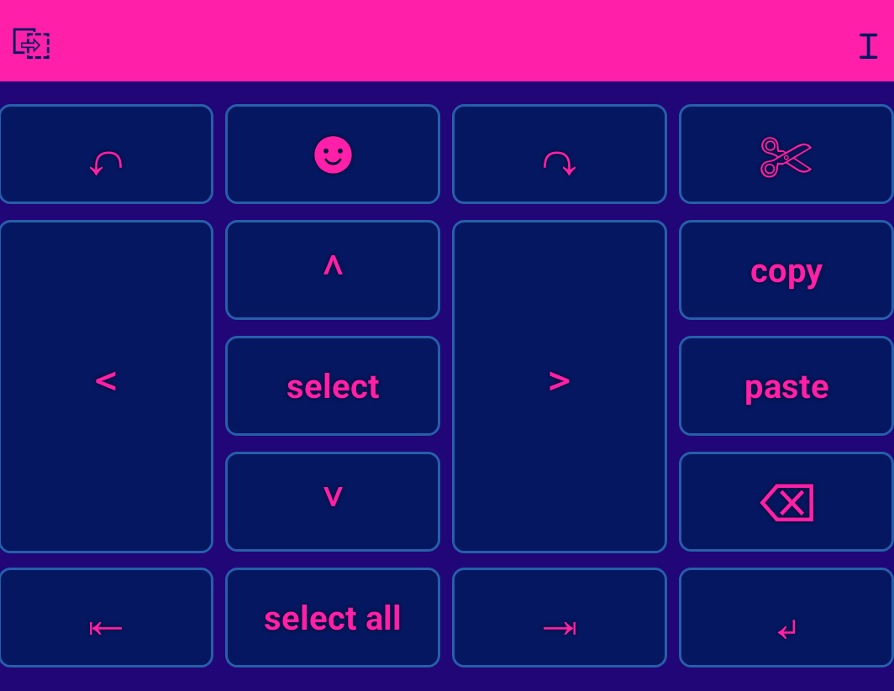

#  FQ-HLL Keyboard 


## Description
The FQ-HLL (Frequency-Quantized HyperLogLog) keyboard is an Android keyboard, that uses the efficient and minimal memory usage [FQ-HLL Autocorrection](https://github.com/shun4midx/FQ-HyperLogLog-Autocorrect) algorithm, which [Shun](https://github.com/shun4midx) took part in creating to become a reality. Its main data structure was the cardinality estimator "HLL". More specifically, it uses certain properties of HLL's bit registers to simulate different frequencies without needing additional storage.

Of course, Shun's fascination over algorithms has inspired the FQ-HLL algorithm, since HLL is rarely used in this context. Yet, more importantly, he is also dyslexic, and has struggled for years never finding a fitting mobile keyboard for him. Autocorrection even by top companies rarely accounted for dyslexics, and oftentimes his typos would not be corrected, unless he manually corrects them himself. Surely, this frustration influenced his creation of the FQ-HLL Autocorrection algorithm --- it almost became a perfect depiction of how he reads as a dyslexic person. He found he did not require as much brainpower anymore to type with this keyboard due to the more dyslexia-friendly autocorrection suggestions, such as "klof" -> "folk".

Thus, here we present the FQ-HLL keyboard which uses the fast and low memory FQ-HLL Autocorrection algorithm. It's made for everyone but especially dyslexic people in mind, with an autocorrection algorithm that hopefully eases common frustrations with autocorrection. FQ-HLL does not require knowledge of any particular language, requiring only a dictionary to achieve high accuracy, which makes it perfect for multilingual users. The ability to have custom dictionaries would also be implemented in the future.

## Installation

Download the latest release of the app [here](https://github.com/shun4midx/FQ-HLL-Keyboard/releases/latest), install the apk and head to your phone's keyboard settings. Enable `FQ-HLL Keyboard` and switch to the keyboard.

The latest (development) release build of the app can be downloaded [here](https://github.com/shun4midx/FQ-HLL-Keyboard/blob/main/app/release/app-release.apk). This is the most up-to-date version and is recommended unless a version of the app is released recently.

You can also launch system keyboard settings and switch keyboards from the installed app.

Keyboard settings can be found by launching the FQ-HLL Keyboard app installed with the apk, or by pressing the `⎋` button on the keyboard/holding down enter key in zhuyin keyboard.

Keyboard settings are saved across updates of the app.

## Features

- FQ-HLL autocorrect algorithm
- Clipboard, text editor, symbols, and emojis
- Coyote-time-like handling of simutaneous key presses
- Autocorrect/autocapitalization toggle
- Lots of [themes](https://github.com/shun4midx/FQ-HLL-Keyboard/tree/main/themes#readme) and theme customisability (key colour, key text colour, key pressed colour, key border colour, keyboard background colour, suggestion bar (text) colour, key popup (text) colour)
- Height customisation (short, medium, tall)
- Text editor mode customisation (maximize, grid)
- Exporting/Importing English Dictionary from file
- Multiple keyboard layouts with layout specific autocorrection (qwerty, azerty, qwertz, dvorak, colemak)

## Usage

#### Importing and Exporting English Dictionary

The import/export functions can be accessed through the FQ-HLL Keyboard App installed with the apk.

#### Suggestion Bar

The bolded word will autoreplace your typed word (user-word) if you hit space.

When there is a bolded suggestion, the first suggestion to the left is the user-word. You can long press the user-word to add it to dictionary, or long press a suggestion to remove the suggestion from dictionary.

If the suggestion is wrong, you can long press enter to skip the replacement.

More suggestions can be accessed in Chinese keyboard layouts by tapping the clipboard button.

When there are no suggestions, long pressing the enter key enters password mode, where your inputs are not displayed on the suggestion bar.

You can long press the text editor button to change languages.

#### Main Keyboard

| Key | Long Press function |
|-----|---------------------|
| comma `,` | select all |
| full stop `.` | delete last word |
| symbols `!?#` | numpad |
| enter `↵` | skip replacement/password mode |
| clipboard `⎘` | super/subscript mode |
| text editor `𝙸` | change languages |
| caps lock `Caps` | copy selected/paste last copied |

#### Super/Subscript Keyboard/Mathbb Keyboard

Access the Super/Subscript keyboard by long pressing clipboard in the main keyboard. You can long press a superscripted character to type its subscripted version, and long press `.` to type a fancy fraction symbol.

The Caps key toggles between the mathbb keyboard and the super/subscript keyboard when using one of them.

#### Symbols

There are two pages in the symbol keyboard, with the first being regular symbols, and the second being math symbols.

Chinese symbols are available in the symbol keyboard when typing in Chinese, and can also be typed by long pressing symbols in the symbol keyboard in English mode.

More symbols can be accessed by holding down a symbol on either page.

##### Symbol Layouts

###### Default (similar to Samsung keyboard layout)


###### Alternative (similar to Gboard layout)



###### Math ([Space Cadet](https://en.wikipedia.org/wiki/Space-cadet_keyboard) layout)



#### Zhuyin
We now support traditional Chinese typing via Zhuyin, with both the normal Zhuyin layout and an alternate Eten layout! It supports fuzzy Zhuyin typing (i.e. there is no need for 100% accuracy with typing), and selection based on common phrases instead of word-by-word. However, as of right now, you would need to type the Zhuyin  **with the tone of the word**. The first tone is parsed as a "whitespace". We referenced `tsi.json` from [`dylandy/tobopomo.js`](https://github.com/dylandy/tobopomo.js/tree/master/data/tsi.json), with the addition of the words 啲 (ㄉㄧ), 喺 (ㄒㄧˋ, ㄒㄧˊ), 佢 (ㄑㄩˊ), 㗎 (ㄐㄧㄚˋ), 嚟 (ㄌㄧˊ), 哋 (ㄉㄧˋ), 咗 (ㄗㄨㄛˇ), 俾 (ㄅㄟ), 嗰 (ㄍㄜˇ), 嘢 (ㄧㄝˇ), and many other words which are common in Cantonese speech. The addition of these words made us name it `tsi_custom.json`, which can be found [here](https://github.com/shun4midx/FQ-HLL-Keyboard/blob/main/app/src/main/assets/tsi_custom.json). 

We also rank fuzzy suggestions, displayed after all correct suggestions, with single-character Chinese suggestions using character frequency as one of the ranking signals, based on a [source](https://teric.naer.edu.tw/wSite/ct?ctNode=645&mp=teric_b&xItem=2068770&resCtNode=453) from the Taiwan Education Resources Information Center, detailing Chinese character frequency in Taiwan in 2023. It is downloaded from `附件下載1` on the linked page, and the raw file can be accessed [here](https://github.com/shun4midx/FQ-HLL-Keyboard/blob/main/app/src/main/assets/附錄1、民國112年語料字頻表.xlsx). 

##### Zhuyin Keyboard

Individual Zhuyin characters can be typed by long pressing the respective key.

More suggestions can be accessed by tapping the clipboard button.

Chinese symbols are available in the symbol keyboard when typing in Chinese, and can also be typed by long pressing symbols in the symbol keyboard in English mode.

#### Pinyin

We also support a preliminary version of Pinyin typing under the same traditional Chinese dictionary. It currently does not support fuzzy typing, and requires the user to **type a whitespace at the end of each syllable**, to be able to parse the corresponding characters correctly. After the syllable, the user can type a number (0~4) to indicate the tone of the character, before the whitespace. However, tones are optional for Pinyin.

Similar to Zhuyin, for toneless Pinyin input, single-character Chinese suggestions from different tone variants are interleaved and ranked using the same character-frequency source.

##### Pinyin Keyboard

Individual Pinyin (alphabetical) characters can be typed by long pressing the respective key.

More suggestions can be accessed by tapping the clipboard button.

Tones can be inputted at the end of a word by appending the tone (`0`, `1`, `2`, `3`, `4`) at the end of each word.

Multiple words can be typed at once if they are separated by spaces.

#### Clipboard

The clipboard displays copied text. You can paste an item by clicking on its box.

You can copy/paste by using the android copy/paste system, long pressing Caps to copy (if selected text) or paste (if no selected text) the last item in the clipboard, or using the text editor.

The paste function supports pasting images, but images are not stored in the clipboard.

You can delete an item by long pressing its box, or long press the clipboard button to clear the entire clipboard.

#### Numpad

You can access the numpad by long pressing symbols, or through the emoji keyboard.

There is a built-in calculator that can be accessed by typing `==` on the numpad/symbol keyboard, or hitting the enter key on the numpad after an expression to evaluate it.

To enter a newline on the numpad, long press the enter key.

#### Text Editor

- grid mode (left), maximize mode (right)

 

## Customisation

### Keyboard height

You can build a custom apk using github actions with the keyboard height of your choice. The built apk will be exported as the workflow run artifact. Use the example workflow below or [fork this repository](https://github.com/shun4midx/FQ-HLL-Keyboard/fork) and run [trigger_custom_apk.yml](https://github.com/shun4midx/FQ-HLL-Keyboard/blob/main/.github/workflows/trigger_custom_apk.yml).

Choose the "Custom" keyboard height in settings to use it. Note that the built apk is a debug apk and is not signed unlike the official releases.

[example workflow](https://github.com/shun4midx/FQ-HLL-Keyboard/blob/main/.github/workflows/trigger_custom_apk.yml):
```yml
name: Build custom FQ-HLL Keyboard apk

on:
  workflow_dispatch:

jobs:
  build:

    uses: shun4midx/FQ-HLL-Keyboard/.github/workflows/build_custom_apk.yml@main
    with:
      # in dp; default main keyboard heights are short: 45, medium: 50, tall: 60
      keyboard-height: 50
```

### Themes

You can view the themes in the [themes folder](https://github.com/shun4midx/FQ-HLL-Keyboard/tree/main/themes#readme).

Want a custom theme? Customisable themes may be implemented in the future, but until then you can open an issue to request one. Please include hex codes of key colour, key text colour, key pressed colour, key border colour, keyboard background colour, suggestion bar colour, and suggestion bar text colour. Alternatively, fork the repository, edit themes.xml, and either build your own apk or open a pull request.

## Development usage

Install android studio and run the app. The usage after installation is the same as [installing from apk](https://github.com/shun4midx/FQ-HLL-Keyboard?tab=readme-ov-file#installation).

### Keyboard files

`CustomKeyboardApp.java` and `MainActivity.kt` contains the code of the keyboard and the settings app respectively.

```
app/src/main
├── AndroidManifest.xml
├── cpp
│   ├── CMakeLists.txt
│   ├── FQ-HyperLogLog-Autocorrect
│   └── native-lib.cpp
├── ic_launcher-playstore.png
├── java/com/fqhll/keyboard
│   ├── CustomKeyboardApp.java
│   ├── CustomKeyboardView.java
│   ├── MainActivity.kt
│   ├── PinyinTyper.java
│   ├── Suggestion.java
│   └── ZhuyinTyper.java
└── res
    ├── layout
    │   ├── activity_main.xml
    │   ├── custom_keyboard_layout.xml
    │   ├── custom_keyboard_preview.xml
    │   ├── item_candidate_chip.xml
    │   └── spinner.xml
    ├── raw
    │   ├── click.mp3
    │   ├── meow.mp3
    │   ├── oiiai.mp3
    │   └── quack.mp3
    ├── values
    │   ├── attrs.xml
    │   ├── colors.xml
    │   ├── dimens.xml
    │   ├── strings.xml
    │   └── themes.xml
    └── xml
        ├── backup_rules.xml
        ├── clipboard.xml
        ├── custom_keypad_azerty.xml
        ├── custom_keypad_colemak.xml
        ├── custom_keypad_dvorak.xml
        ├── custom_keypad_medium.xml
        ├── custom_keypad_pinyin.xml
        ├── custom_keypad_qwerty.xml
        ├── custom_keypad_qwertz.xml
        ├── custom_keypad_short.xml
        ├── custom_keypad_tall.xml
        ├── custom_keypad_zhuyin_eten.xml
        ├── custom_keypad_zhuyin.xml
        ├── custom_method.xml
        ├── data_extraction_rules.xml
        ├── editor_grid.xml
        ├── editor_maximize.xml
        ├── emojis.xml
        ├── math_symbols.xml
        ├── numpad.xml
        └── symbols.xml
```

### latest development apk

They are not guaranteed to work, but you get the latest features. Feel free to open an issue if you found a bug that isn't listed in the todo below.

https://github.com/shun4midx/FQ-HLL-Keyboard/blob/main/app/release/app-release.apk

Prereleases are relatively more tested development versions of the app if you prefer a more stable app.

### todo

- [ ] customise symbols
- [ ] fully customise themes
- [x] emoji support (emoji page like symbols?)
- [x] clipboard
- [x] settings app layout
- [x] hold keys for symbols
- [x] add documentation on long press symbol modified samsung keyboard/gboard layouts
- [x] multiple languages support?
- [ ] customise keyboard height
- [x] custom background image
- [x] key opacity
- [ ] custom key preview colour
- [x] figure out a way to build gradle project using github actions
- [x] fix unsigned release apk not working
- [x] sign apk
- [x] second page of symbols
- [x] be able to delete highlighted text
- [x] load changed themes without needing a refresh of keyboard (and without breaking popup/preview)
- [x] coyote-time-like queueing of handling simutaneous key presses
- [x] an easy way to add word to dictionary
- [ ] emoji suggestions in place of predictive text
- [x] bypass autocorrected word by long pressing enter
- [x] numpad
- [x] add grid/maximize mode previews to readme
- [ ] changing non main keyboard height
- [x] text editor symbols
- [x] fully finish text editor
- [x] clipboard being able to access/use android copy key
- [x] add different keyboard layouts
- [x] hold down clipboard button to delete individual entries
- [x] edit dictionary by holding down button
- [x] edit dictionary in app
- [x] custom keyboard layout autocorrection
- [x] export/import custom dictionary
- [x] check if word is null before adding/removing
- [x] add key sound
- [x] hold down . to delete word
- [x] text editor select button

## Contact

You can contact Shun via [Email](mailto:shun4midx@gmail.com) or Discord at @shun4midx, and Ducky via [Email](mailto:ducky4life@duck.com).

## License

Most of FQ-HLL-Keyboard is licensed under the MIT License.

`app/src/main/assets/tsi_custom.json` is derived from `tobopomo.js/data/tsi.json` from the [`dylandy/tobopomo.js`](https://github.com/dylandy/tobopomo.js) project and is distributed under the GNU Lesser General Public License v3.0 (LGPL-3.0).

See [`THIRD_PARTY_LICENSES.md`](THIRD_PARTY_LICENSES.md) and [`licenses/LGPL-3.0.md`](licenses/LGPL-3.0.md) for details.